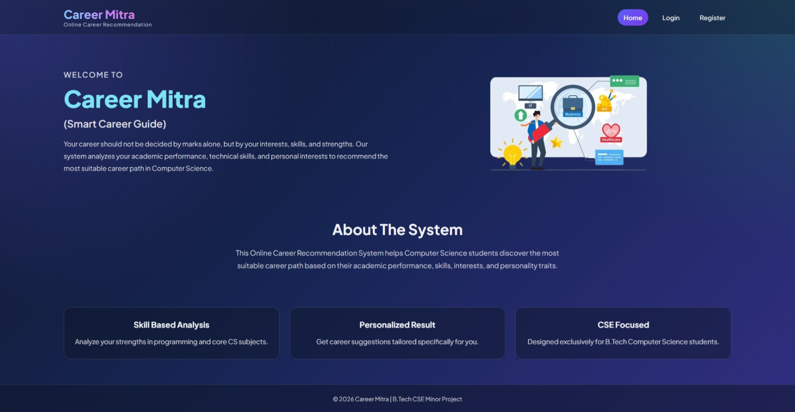
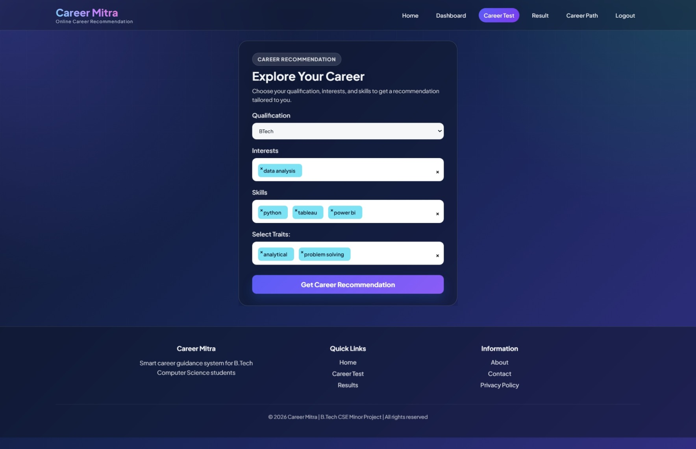
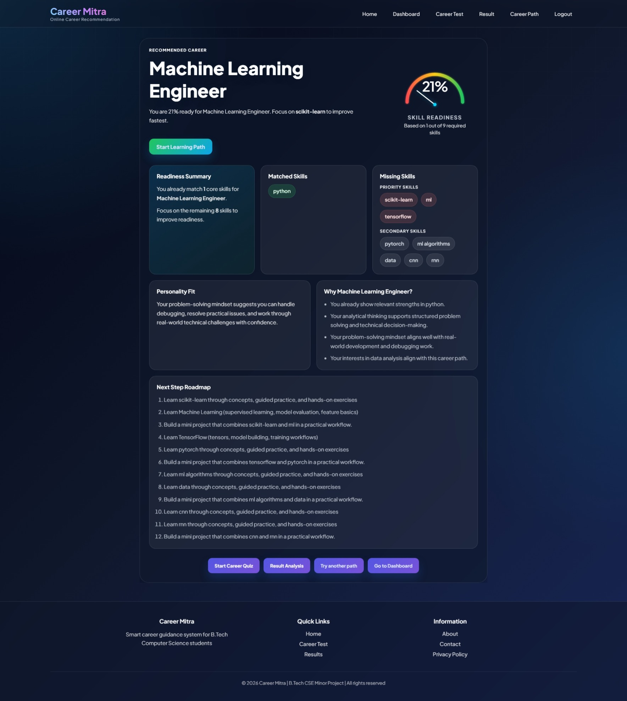
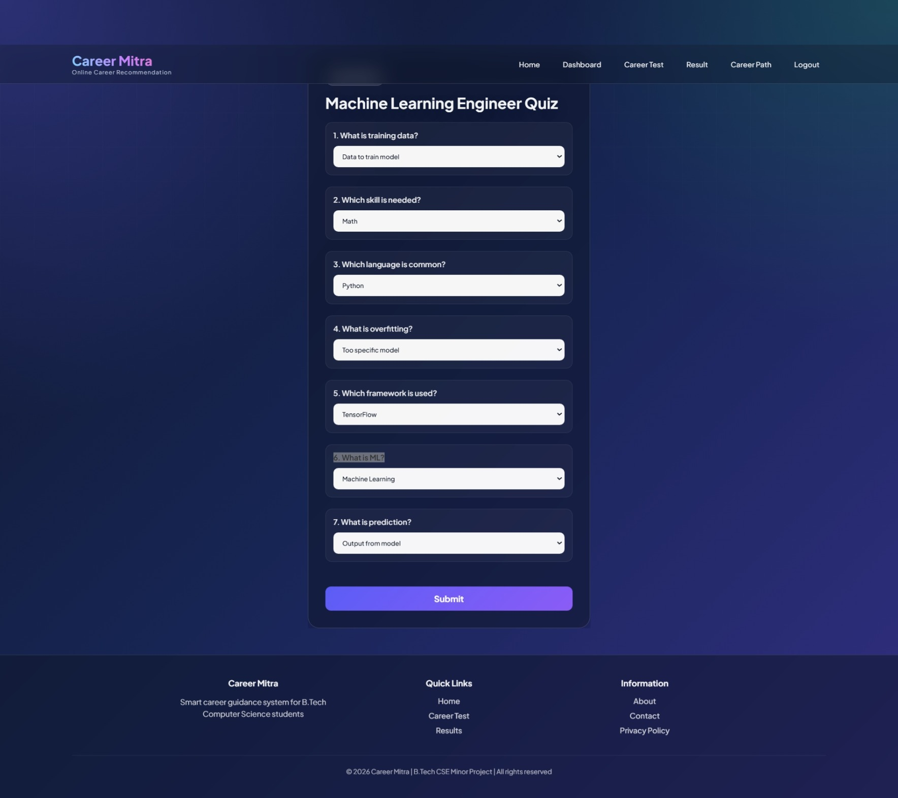
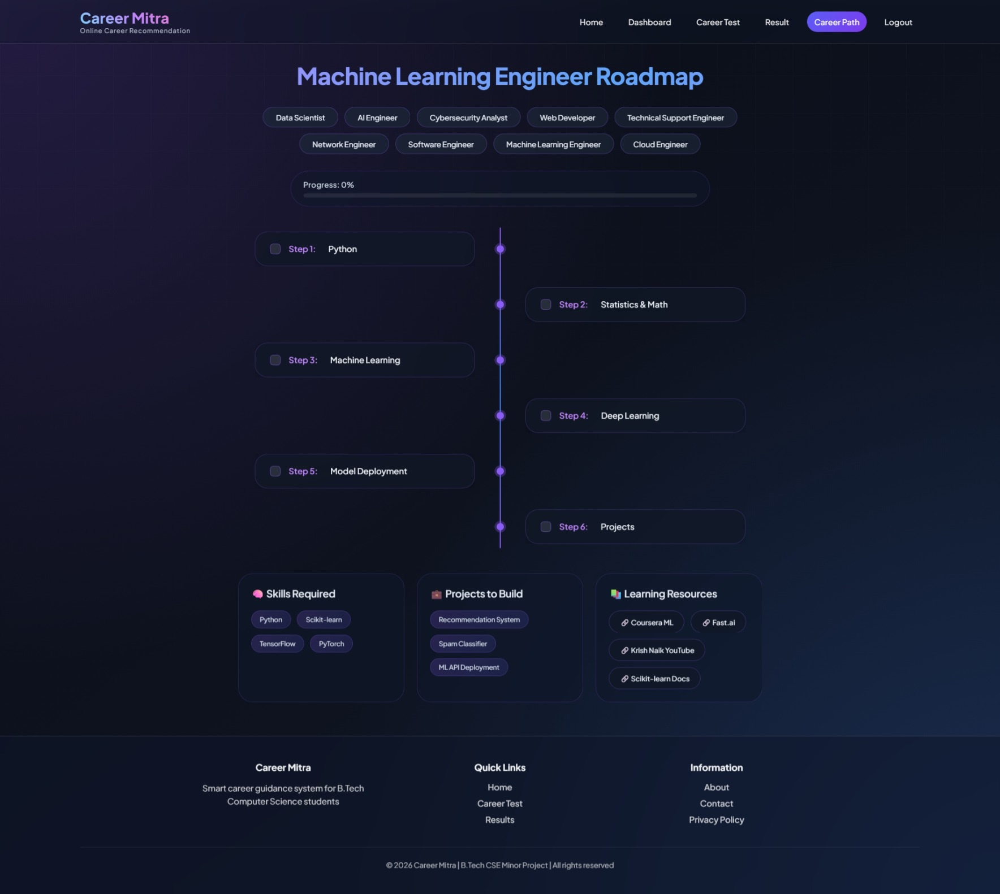
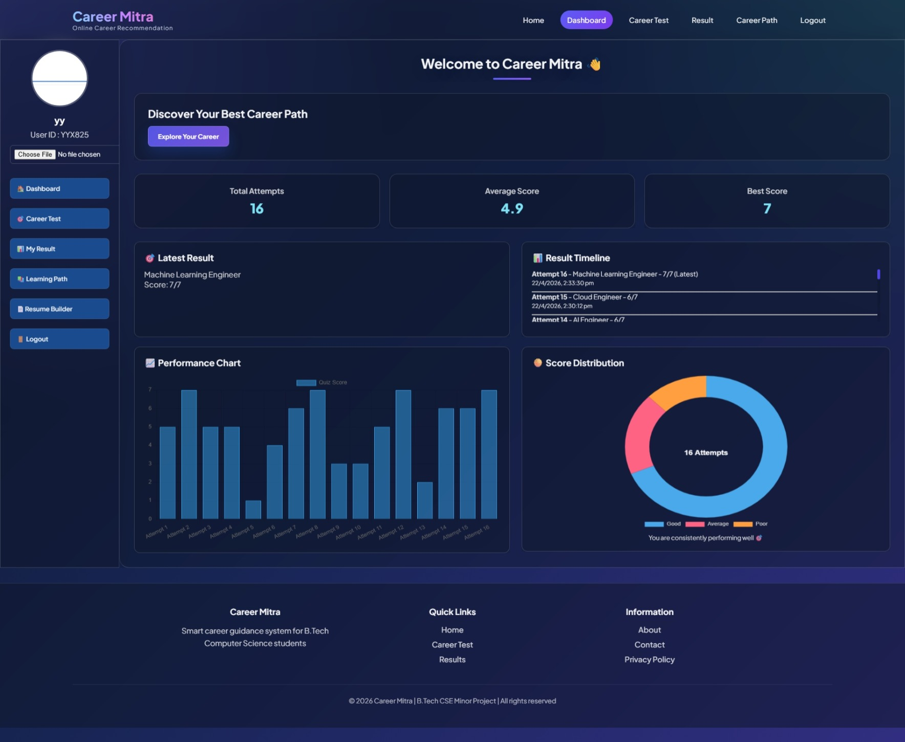
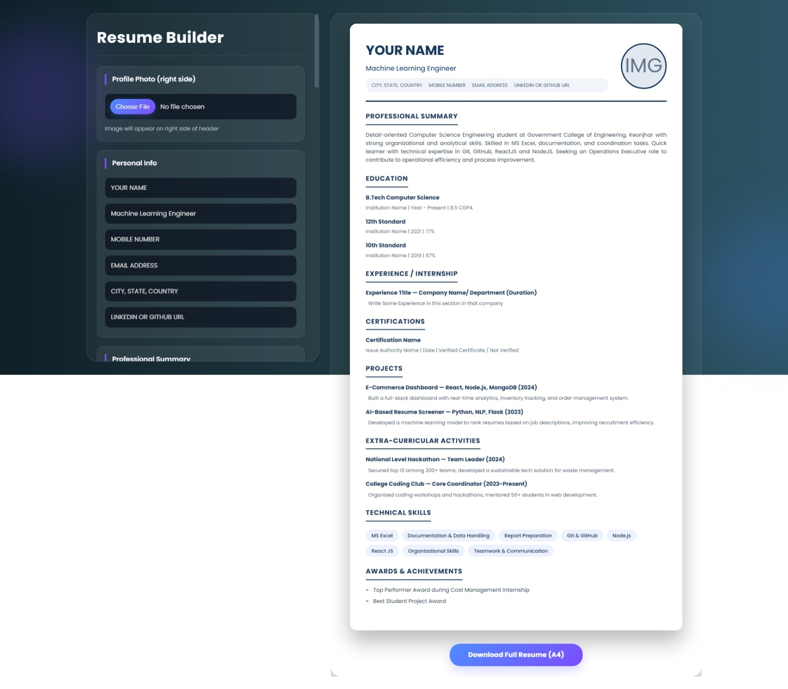

# carrier-recommendation-system-project
# Career Mitra 🚀

Career Mitra is an AI-powered career guidance web application that helps users discover suitable technology career paths based on their qualifications, skills, interests, and personality traits.

It combines Machine Learning, skill-gap analysis, quizzes, career roadmaps, and Firebase authentication into one platform.

---

## Features

### Career Prediction using Machine Learning

 ## Home
 

* Uses a Random Forest model to predict suitable careers.
* Input factors:

  * Qualification
  * Skills
  * Interests
  * Personality Traits
  ## FORM PAGE
 


### Skill Gap Analysis

* Compares user skills against required career skills.
* Shows:

  * Matched skills
  * Missing skills
  * Readiness percentage
 ## RESULT
 

### Career Quiz

* Dynamic career-specific quiz generation.
* Stores attempt history.
* Dashboard visualizations using charts.
 ## QUIZ
 

### Career Path Roadmaps

Provides for each career:

* Learning steps
* Required skills
* Project ideas
* Learning resources
 ## ROADMAP
 

### Firebase Authentication

* User Registration/Login
* Password Reset
* Session Management
* Protected Dashboard Access
## REGISTER
 

## LOGIN
 

### Dashboard Analytics

* Latest prediction
* Quiz history
* Average and best scores
* Performance charts
 ## DASHBOARD
 


### Resume Builder

*  Take the details from the user and make a fantastic resume .
## RESUME
 
---

## Tech Stack

### Frontend

* HTML
* CSS
* JavaScript
* Chart.js

### Backend

* Flask (Python)

### Machine Learning

* Scikit-learn
* Random Forest Classifier
* Joblib serialized models

### Authentication

* Firebase Authentication

### Deployment

* Render
* Gunicorn

---

## Project Structure

```bash
Career-Mitra/
│
├── app.py
├── predict.py
├── skill_gap.py
├── quiz_data.py
├── career_path_data.py
├── carrier_skill_catalog.py
├── career_data.csv
│
├── model.pkl
├── le_q.pkl
├── le_c.pkl
├── mlb_skills.pkl
├── mlb_interests.pkl
├── mlb_traits.pkl
│
├── templates/
├── static/
├── requirements.txt
└── README.md
```

---

## Installation (Local Setup)

Clone repository:

```bash
git clone https://github.com/yourusername/career-mitra.git
cd career-mitra
```

Install dependencies:

```bash
pip install -r requirements.txt
```

Run application:

```bash
python app.py
```

Open:

```bash
http://127.0.0.1:5000
```

---

## Environment Variables

Create a `.env` file:

```env
FLASK_SECRET_KEY=your_secret_key
FIREBASE_API_KEY=your_api_key
FIREBASE_AUTH_DOMAIN=your_project.firebaseapp.com
FIREBASE_PROJECT_ID=your_project_id
FIREBASE_STORAGE_BUCKET=your_storage_bucket
FIREBASE_MESSAGING_SENDER_ID=your_sender_id
FIREBASE_APP_ID=your_app_id
```

---

## Deployment on Render

Build Command:

```bash
pip install -r requirements.txt
```

Start Command:

```bash
gunicorn app:app
```

---

## Supported Career Domains

Includes recommendations for careers such as:

* Data Scientist
* Web Developer
* AI Engineer
* Cybersecurity Analyst
* Cloud Engineer
* UI/UX Designer
* Mobile App Developer
* Game Developer
* DevOps Engineer
* Blockchain Developer
* Data Analyst
* Machine Learning Engineer
* Software Engineer
* System Administrator
* Software Tester
* AR/VR Developer
* Embedded Engineer
* Network Engineer
* Technical Support Engineer
* Product Manager

---

## Machine Learning Model

Model used:

* Random Forest Classifier

Serialized files:

* model.pkl
* le_q.pkl
* le_c.pkl
* mlb_skills.pkl
* mlb_interests.pkl
* mlb_traits.pkl

---

## Future Enhancements

* Resume Analyzer

* Career Recommendation Improvements
* Firestore User Data Storage
* Personalized Learning Plans


